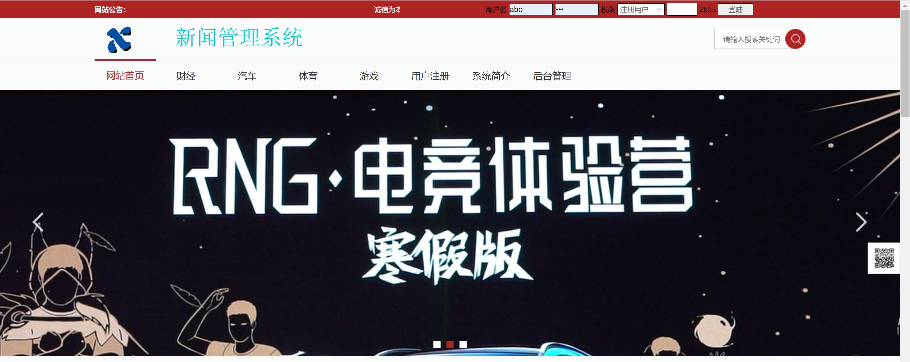
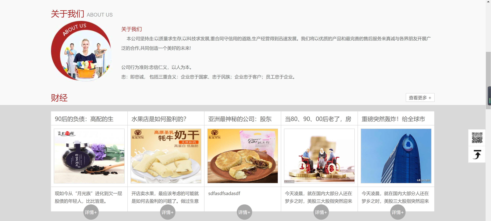
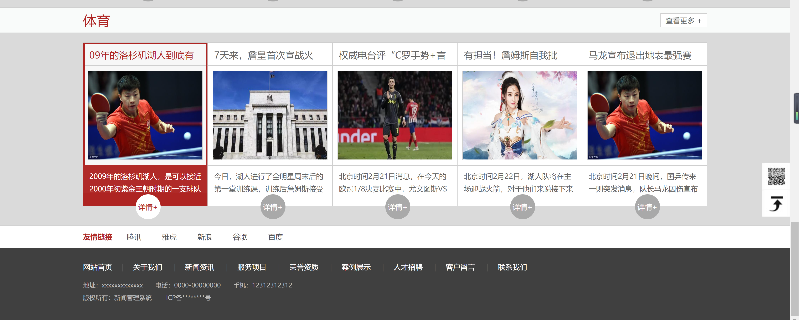
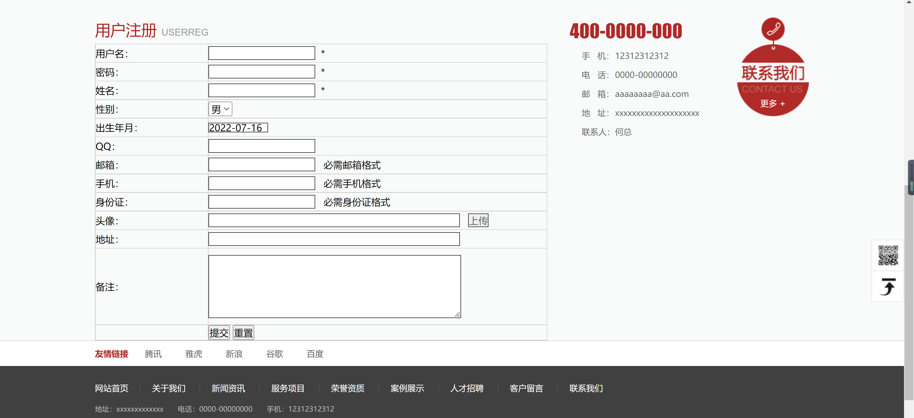
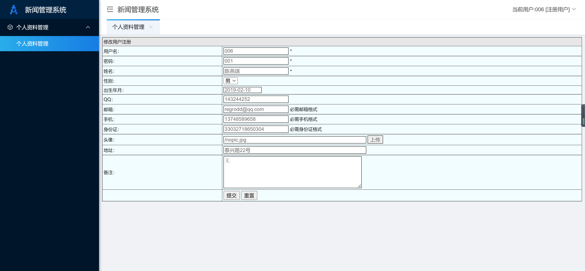
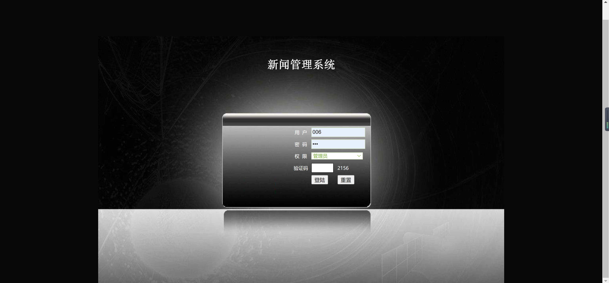
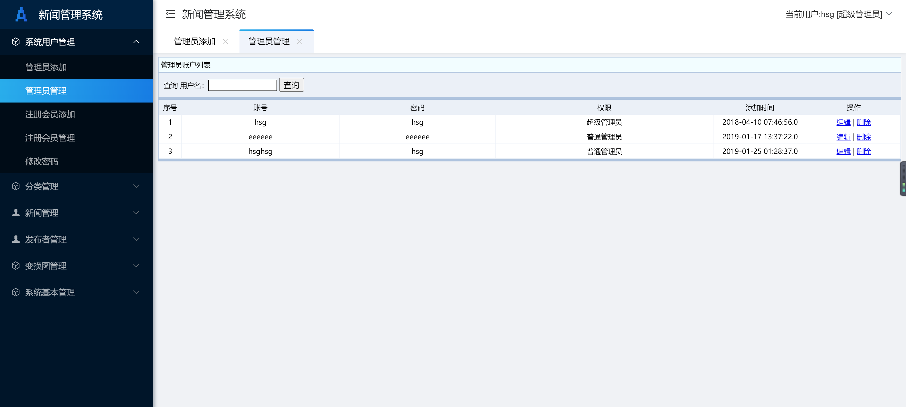
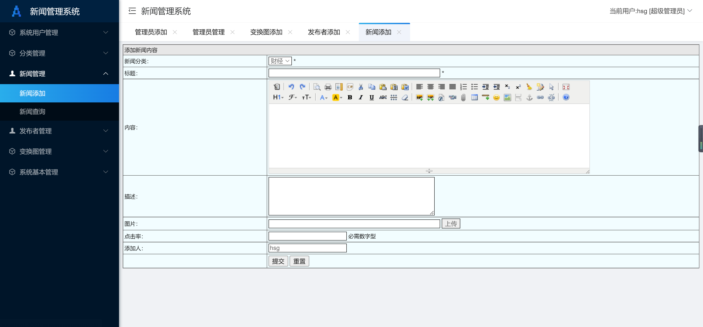

<h1 align="center">新闻管理系统</h1>

## 简介
新闻管理系统：该系统包括用户注册、登录验证、管理员管理、新闻发布与编辑、个人资料管理等功能模块，用户可以轻松管理和维护新闻内容，提升工作效率。    --计算机毕业设计源码；毕设源码；java毕业设计源码

## 联系方式

<h3 align="center">获取完整代码与数据库文件 + 微信：deepguan QQ: 86050149 QQ群: 783742310</h3>

<h3 align="center">可帮忙远程部署 包运行成功！提供远程部署、修改代码、设计文档指导、代码讲解等服务！</h3>

## 功能介绍（完整见运行截图）
管理员：基本功能包括系统管理登录和权限区分，拥有修改和删除管理员帐号的管理功能，以及通过搜索工具进行管理员账号的精准查询。可添加、编辑、删除新闻，设定新闻分类、标题、内容描述及图片上传，并记录新闻点击率。个人信息修改功能涵盖详细信息管理，如联系方式、地址和头像上传，同时需满足格式要求。

用户：基本功能包括系统登录、注册及安全验证，通过用户角色权限选择提供安全高效的身份验证流程。注册时需填写基本和详细信息, 上传头像，提供多种联系方式。可通过导航链接访问系统首页、查看关于我们、新闻资讯等，增强用户体验和信息获取便捷性。

新闻发布者：负责添加和编辑新闻内容，选择新闻分类，录入标题、内容、描述和访问量，上传相关新闻图片。利用系统提供的富文本编辑器调整文字格式，以确保新闻内容的高质量展示。功能导航菜单支持快速切换至系统其他模块，实现高效管理。

浏览者：可在系统中浏览各类新闻信息，通过详细分类（如财经、体育等）查找内容。通过主页和导航栏快速进入感兴趣模块，使用“详情”按钮获取更深入的新闻内容。此外,系统提供分享或互动功能增强用户参与感，设计简洁提高浏览体验。

## 运行截图

本代码来源于网络,仅供学习参考使用!

